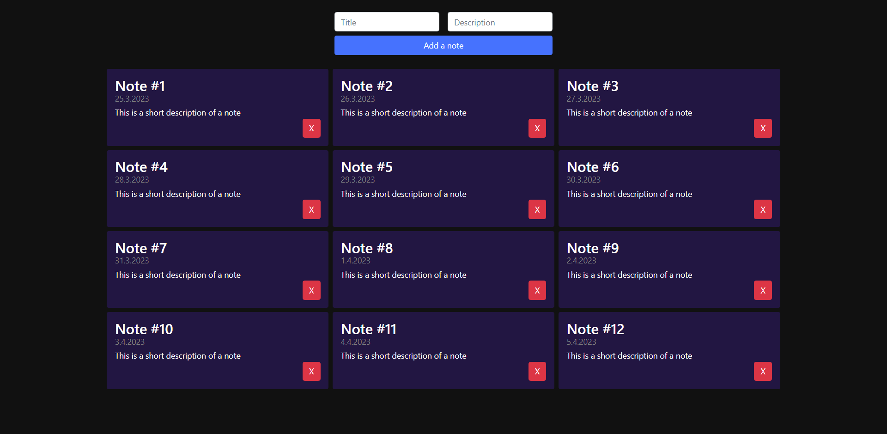

# 📝 <b>StickyNotes</b> 📝

StickyNotes web application, using ejs, express.js and mongoDB.

## 📚 How To Use 📚

```
1. npm i
```

2. Make a mongoDB database and collection.
3. Change dbName and collectionName in <b>server.js</b> file

```js
const dbName = "your_db_name";
const collectionName = "your_collection_name";
```

## 📷 Preview 📷


